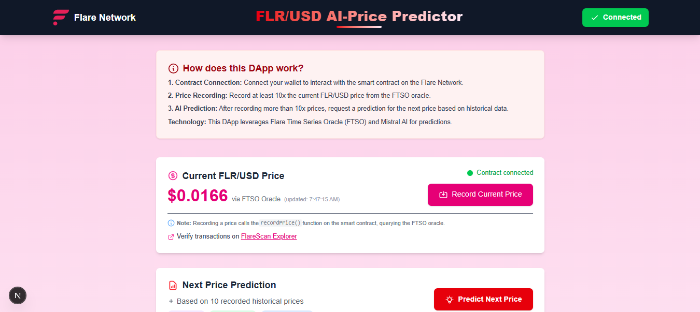
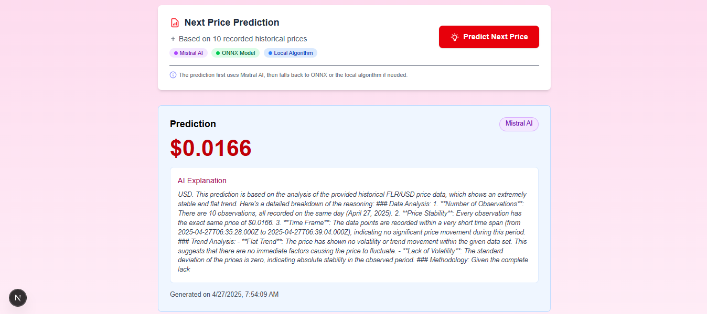

<h1 align="center">Flare AI Price Predictor dApp</h1>

<div align="center">
  
</div>

<div align="center">
  <p>
    <a href="#"></a>
    <a href="#"></a>
    <a href="#"></a>
    <a href="#"></a>
    <a href="#"></a>
    <a href="#"></a>
    <a href="#"></a>
  </p>
</div>

## 📑 Table of Contents

- [Overview](#-overview)
- [Architecture & Workflow](#-architecture--workflow)
- [Key Features](#-key-features)
- [Technology Stack](#-technology-stack)
- [Project Structure](#-project-structure)
- [Smart Contract Integration](#-smart-contract-integration)
- [AI Price Prediction System](#-ai-price-prediction-system)
- [Local Development](#-local-development)
- [Deployment Guide](#-deployment-guide)
- [Learning Pathway](#-learning-pathway)
- [Troubleshooting](#-troubleshooting)
- [Resources](#-resources)
- [Contributing](#-contributing)
- [Flare Ambassador Program](#-flare-ambassador-program)

## 🚀 Overview

The Flare AI Price Predictor is an educational dApp that demonstrates how to combine blockchain oracles with artificial intelligence to predict cryptocurrency prices. It showcases integration between Flare's Time Series Oracle (FTSO) and modern AI prediction methods.

This project serves as a practical tutorial for developers interested in:

- Building decentralized applications on the Flare Network
- Leveraging blockchain oracles for reliable price data
- Implementing AI prediction models with graceful degradation
- Creating responsive, interactive UIs for DeFi applications

<div align="center">
  
  
  
</div>

## 🔄 Architecture & Workflow

The application follows a three-layer architecture that combines blockchain data sources, on-chain storage, and AI-powered predictions:

```shell
┌─────────────────┐     ┌─────────────────┐     ┌─────────────────┐
│  FTSO ORACLES   │     │  SMART CONTRACT │     │  FRONTEND APP   │
│                 │     │                 │     │                 │
│ Price Feed Data ├────►│ Data Recording  ├────►│ User Interface  │
│ (FLR/USD)       │     │ & Storage       │     │                 │
└─────────────────┘     └─────────────────┘     └───────┬─────────┘
                                                        │
                                                        ▼
                                               ┌─────────────────┐
                                               │  AI PREDICTION  │
                                               │                 │
                                               │ 1. Mistral AI   │
                                               │ 2. ONNX Model   │
                                               │ 3. Local Algo   │
                                               └─────────────────┘
```

**User Flow:**

1. Connect wallet to the Flare Coston2 testnet
2. Record current FLR/USD price from FTSO oracle via smart contract
3. View historical price data stored on-chain
4. Generate predictions using AI-powered analysis
5. View prediction with detailed explanation of methodology

## 🌟 Key Features

1. **Blockchain Oracle Integration**

   - Direct connection to Flare's FTSO for reliable price data
   - On-chain storage of historical price information
   - Transparent, immutable record of all price updates

2. **Multi-layered AI Prediction System**

   - Primary: Cloud-based Mistral AI for advanced predictions
   - Secondary: Client-side ONNX model for offline capability
   - Fallback: Local weighted-average algorithm for reliability

3. **Educational User Interface**

   - Step-by-step guidance through the prediction process
   - Visual representation of historical price data
   - Detailed explanations of AI-generated predictions
   - Responsive design for desktop and mobile devices

4. **Graceful Degradation**
   - System continues functioning even when components fail
   - Transparent indication of which prediction method is used
   - Consistent user experience regardless of backend method

## 🔧 Technology Stack

### Backend (Blockchain)

- **Solidity 0.8.28**: Smart contract language
- **Hardhat 2.23.0**: Development environment
- **Ethers.js 6.4.0**: Ethereum interactions
- **Flare Network**: Coston2 testnet
- **FTSO Integration**: Flare Time Series Oracle

### Frontend (Web Application)

- **Next.js 15.x**: React framework
- **React 19.0.0**: UI library
- **Tailwind CSS 4.x**: Styling system
- **Ethers.js**: Web3 integration

### AI & Machine Learning

- **Mistral AI API**: Cloud-based LLM
- **ONNX Runtime 1.21.0**: Client-side ML inference
- **Custom Algorithms**: Weighted average prediction

## 📁 Project Structure

The project is organized into two main components:

```shell
flare-price-predictor/
├── backend/                  # Smart contract & blockchain integration
│   ├── contracts/            # Solidity smart contracts
│   │   └── PriceRecorder.sol # Core contract for FTSO data
│   ├── test/                 # Test suite
│   │   └── FtsoV2Consumer.test.js
│   ├── ignition/             # Hardhat Ignition deployment
│   │   └── modules/
│   │       └── priceRecorder.module.js
│   ├── hardhat.config.js     # Hardhat configuration
│   └── README.md             # Backend documentation
│
├── frontend/                 # Web application
│   ├── src/
│   │   ├── app/              # Next.js pages
│   │   │   └── page.js       # Main application page
│   │   ├── lib/              # Core libraries
│   │   │   ├── ai.js         # AI prediction logic
│   │   │   └── contract.js   # Smart contract integration
│   │   └── artifacts/        # Compiled contract ABIs
│   ├── public/               # Static assets
│   │   └── model.onnx        # ONNX model for predictions
│   ├── package.json          # Dependencies
│   └── README.md             # Frontend documentation
│
├── .env.example              # Environment variables template
├── package.json              # Root project configuration
└── README.md                 # This file
```

## 🔗 Smart Contract Integration

The core of the application is the `PriceRecorder.sol` contract which interacts with Flare's FTSO to fetch and store price data.

### Key Components

#### 1. FTSO Connection

```solidity
// Get the latest FTSO instance
ftsoV2 = ContractRegistry.getFtsoV2();

// Create array with FLR/USD feed ID
bytes21[] memory feedIds = new bytes21[](1);
feedIds[0] = FLR_USD_FEED_ID;
```

#### 2. Price Recording

```solidity
function recordPrice() external {
    // Get price data from FTSO
    (uint256[] memory prices, int8[] memory decimals, uint64 timestamp) =
        ftsoV2.getFeedsById(feedIds);

    // Store in history array
    priceHistory.push(PriceData(prices[0], decimals[0], timestamp));

    // Emit event
    emit PriceRecorded(prices[0], decimals[0], timestamp);
}
```

#### 3. History Retrieval

```solidity
function getLastNPrices(uint256 n) external view returns (PriceData[] memory) {
    require(n <= priceHistory.length, "Not enough data recorded");
    PriceData[] memory lastN = new PriceData[](n);
    for (uint256 i = 0; i < n; i++) {
        lastN[i] = priceHistory[priceHistory.length - n + i];
    }
    return lastN;
}
```

## 🧠 AI Price Prediction System

The project implements a three-tiered prediction system with graceful degradation for maximum reliability.

### 1. Mistral AI Implementation

The primary prediction system uses the Mistral AI API for advanced predictions with natural language explanations:

```javascript
// Format historical data for the AI
const pricesFormatted = prices
  .map(
    (p, i) =>
      `#${i + 1}: $${p.price.toFixed(4)} (${
        new Date(p.timestamp * 1000).toLocaleString().split(",")[0]
      })`
  )
  .join("\n");

// Structure the prompt for the AI
const messages = [
  {
    role: "system",
    content: `You are a financial analyst specializing in predicting the FLR/USD price...`,
  },
  {
    role: "user",
    content: `I need a FLR/USD price prediction based on the following data: ${pricesFormatted}`,
  },
];

// Make API request and extract the prediction
const response = await fetch(API_URL, {
  method: "POST",
  headers: { Authorization: `Bearer ${apiKey}` },
  body: JSON.stringify({ model: MODEL_ID, messages }),
});
```

### 2. ONNX Fallback Model

If the Mistral AI API is unavailable, the app falls back to a local ONNX model:

```javascript
// Load the ONNX model
const session = await ort.InferenceSession.create("/model.onnx");

// Prepare input tensor from historical prices
const input = new Float32Array(prices.map((p) => p.price));
const tensor = new ort.Tensor("float32", input, [1, input.length]);

// Run inference
const feeds = { input: tensor };
const results = await session.run(feeds);

return {
  price: results.output.data[0],
  explanation: "Prediction generated by ONNX model...",
  source: "ONNX Model",
};
```

### 3. Local Algorithm Fallback

As a last resort, a simple weighted average algorithm provides predictions:

```javascript
// Select most recent prices
const pricesToUse = prices.slice(-5);
const recentPrices = pricesToUse.map((p) => p.price);

// Weight more recent prices higher
const weights = Array.from(
  { length: recentPrices.length },
  (_, i) => i + 1
);
const totalWeight = weights.reduce((acc, w) => acc + w, 0);

// Calculate weighted average
const weightedSum = recentPrices.reduce((acc, price, i) => {
  return acc + price * weights[i];
}, 0);
const weightedAvg = weightedSum / totalWeight;

// Add trend analysis
const trend =
  recentPrices[recentPrices.length - 1] -
  recentPrices[recentPrices.length - 2];
const prediction = weightedAvg + trend * 0.5;
```

## 🏗️ Local Development

### Prerequisites

- Node.js 18+ and npm
- MetaMask wallet with Coston2 testnet configured
- Mistral AI API key (optional for enhanced predictions)

### Backend Setup

1. Clone the repository and navigate to the backend directory:

```bash
git clone https://github.com/adelamare-blockchain/Flare-Network_Flare-AI-Price-Predictor.git
cd flare-price-predictor/backend
```

2. Install dependencies:

```bash
npm install
```

3. Create a `.env` file with your credentials:

```
COSTON2_PRIVATE_KEY=your_private_key_without_0x_prefix
FLARESCAN_API_KEY=your_flarescan_api_key
```

4. Compile the contracts:

```bash
npx hardhat compile
```

5. Run tests:

```bash
npx hardhat test
```

6. Deploy to Coston2 testnet:

```bash
npx hardhat ignition deploy ./ignition/modules/priceRecorder.module.js --network coston2 --verify
```

### Frontend Setup

1. Navigate to the frontend directory:

```bash
cd ../frontend
```

2. Install dependencies:

```bash
npm install
```

3. Create a `.env.local` file:

```
NEXT_PUBLIC_CONTRACT_ADDRESS=deployed_contract_address
NEXT_PUBLIC_MISTRAL_API_KEY=your_mistral_api_key
```

4. Start the development server:

```bash
npm run dev
```

5. Open [http://localhost:3000](http://localhost:3000) in your browser.

## 🚢 Deployment Guide

### Smart Contract Deployment

The project uses Hardhat Ignition for reliable, declarative deployments:

1. Configure your environment variables for the Coston2 testnet
2. Run the deployment command:

```shell
 cd backend
 npx hardhat ignition deploy ./ignition/modules/priceRecorder.module.js --network coston2 --verify
```

3. Save the deployed contract address for frontend configuration

### Frontend Deployment

1. Build the production-ready frontend:

   ```shell
   cd frontend
   npm run build
   ```

2. Deploy to your hosting provider of choice (Vercel, Netlify, etc.)
   ```shell
   # Example for Vercel
   vercel --prod
   ```

## 📚 Learning Pathway

This project is designed as an educational resource for blockchain developers. Here's a recommended learning pathway:

### 1. Smart Contract Development

- Study `PriceRecorder.sol` to understand FTSO integration
- Explore the test file to learn about contract testing
- Try extending the contract with additional functionality

### 2. Web3 Frontend Integration

- Examine `contract.js` to learn about ethers.js integration
- Understand the React hooks pattern for blockchain data
- Practice building responsive UIs for blockchain data

### 3. AI Integration

- Review the tiered prediction system in `ai.js`
- Learn about prompt engineering for financial analysis
- Explore ONNX model integration for client-side ML

### 4. Practice Exercises

- Add support for additional price pairs beyond FLR/USD
- Implement a more sophisticated prediction algorithm
- Create an admin interface for contract management
- Add a notification system for significant price changes

## 🔍 Troubleshooting

### Common Issues

#### Blockchain Connection

- **Issue**: MetaMask not connecting
  - **Solution**: Ensure Coston2 network is added to MetaMask
  - **Network Details**:
    - Name: Flare Coston2 Testnet
    - RPC URL: https://coston2-api.flare.network/ext/C/rpc
    - Chain ID: 114
    - Symbol: C2FLR

#### Contract Interaction

- **Issue**: "Transaction reverted" errors
  - **Solution**: Check that you have sufficient C2FLR for gas fees
  - **Get Testnet FLR**: Visit [Coston2 Faucet](https://faucet.flare.network/coston2)

#### AI Prediction

- **Issue**: Prediction always uses local algorithm
  - **Solution**: Verify your Mistral API key is correctly set in environment variables

#### Transaction Verification

- **Issue**: Need to verify if a transaction was successful
  - **Solution**: Check the transaction on Flare's block explorer
  - **Contract Address**: [0x3a9B67392Df4d0CC180bcADA35d06D8648b86600](https://coston2.testnet.flarescan.com/address/0x3a9B67392Df4d0CC180bcADA35d06D8648b86600)
  - **Explorer**: [Coston2 Flarescan](https://coston2.testnet.flarescan.com/)

## 📖 Resources

- [Flare Network Documentation](https://dev.flare.network/)
- [FTSO Documentation](https://dev.flare.network/tech/ftso/)
- [Hardhat Documentation](https://hardhat.org/docs)
- [Next.js Documentation](https://nextjs.org/docs)
- [Mistral AI Documentation](https://docs.mistral.ai/)
- [ONNX Runtime Web](https://onnxruntime.ai/docs/tutorials/web/)

## 💡 Contributing

Contributions are welcome! Here are some ways you can contribute:

1. **Improve the AI prediction accuracy**

   - Enhance the Mistral AI prompt engineering
   - Implement a more sophisticated ONNX model
   - Add additional fallback methods

2. **Extend the smart contract**

   - Add support for multiple price pairs
   - Implement access control mechanisms
   - Create aggregation functions for historical data

3. **Enhance the UI/UX**
   - Improve the data visualization components
   - Add additional educational elements
   - Optimize mobile responsiveness

## 🏆 Flare Ambassador Program

This project is part of the Flare Ambassador Program, which encourages developers to build innovative applications on the Flare Network.

For more information, visit the [Flare Developer Portal](https://dev.flare.network/).

---

<div align="center">
  <p>
    <strong>© 2025 Flare AI Price Predictor</strong><br>
    Built for the Flare Ambassador Program
  </p>
  <p>
    Created by <a href="https://github.com/adelamare-blockchain">Antoine Delamare</a> | <a href="https://www.blockchain-cie.com/">Blockchain & Cie</a>
  </p>
  <p>
    <a href="https://github.com/adelamare-blockchain"></a>
    <a href="https://x.com/blockchain_cie"></a>
    <a href="https://www.linkedin.com/in/adelamare-blockchain/"></a>
  </p>
</div>
