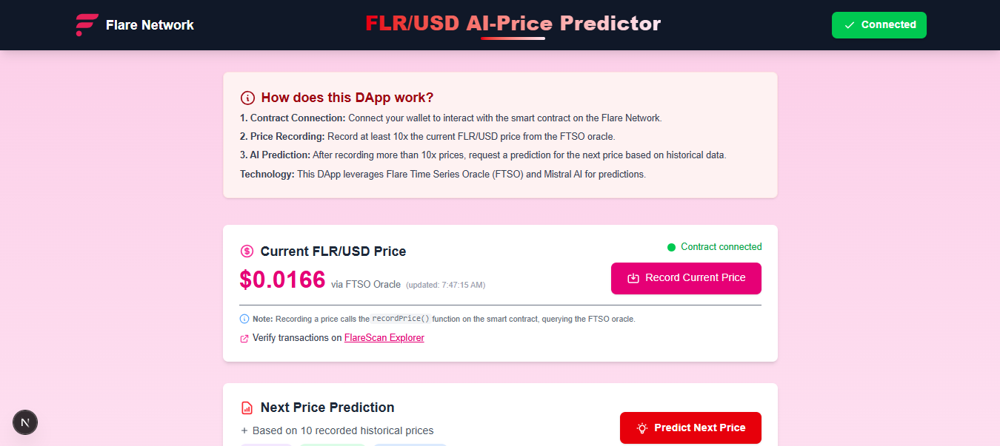
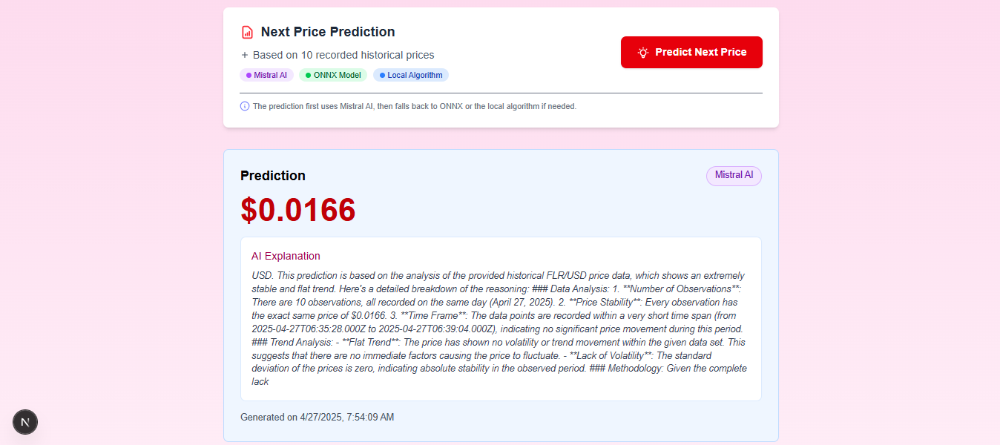
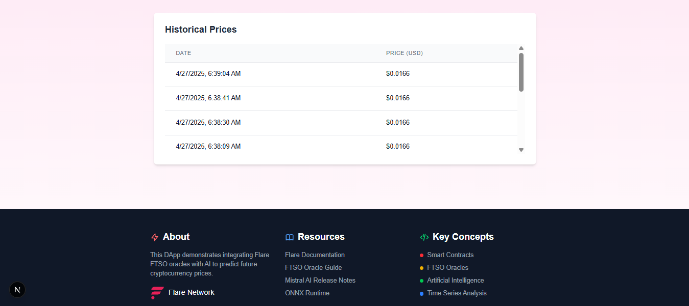

# 🔮 Flare AI Price Predictor - Frontend

This repository contains the frontend for an AI-powered price prediction dApp built on the Flare Network. It demonstrates how to combine decentralized oracles (FTSO) with AI capabilities to create predictive financial applications.

## 📋 Table of Contents

- [Overview](#overview)
- [Key Features](#key-features)
- [Technology Stack](#technology-stack)
- [Architecture](#architecture)
- [Smart Contract Integration](#smart-contract-integration)
- [AI Integration](#ai-integration)
  - [Mistral AI Implementation](#mistral-ai-implementation)
  - [ONNX Fallback Model](#onnx-fallback-model)
  - [Local Algorithm Fallback](#local-algorithm-fallback)
- [Installation Guide](#installation-guide)
- [Usage Guide](#usage-guide)
- [Educational Resources](#educational-resources)
- [Contributing](#contributing)
- [Flare Ambassador Program](#flare-ambassador-program)

## 🚀 Overview

This dApp demonstrates how to leverage blockchain oracles and artificial intelligence to predict cryptocurrency prices. It serves as an educational tool for developers looking to combine blockchain data sources with AI prediction models.

<div align="center">
  
  
  
</div>

**Core Functionality:**

- Record FLR/USD price data from Flare's Time Series Oracle (FTSO)
- Store historical price data on-chain
- Generate price predictions using layered AI approaches
- Provide educational explanations about the prediction methodology

This project is designed as a learning resource for developers interested in:

- Web3 interaction with blockchain oracles
- Integration of AI prediction models with on-chain data
- Building responsive UIs for DeFi applications
- Implementing graceful degradation in AI systems

## 🌟 Key Features

1. **Smart Contract Integration**: Connect to and interact with the FTSO oracle via a dedicated smart contract
2. **Historical Price Recording**: Save and visualize time-series price data on the Flare blockchain
3. **Multi-layered AI Prediction**:
   - Primary: Mistral AI API for advanced predictions with explanations
   - Secondary: ONNX model for client-side predictions
   - Fallback: Local algorithm for basic predictions when other methods fail
4. **Responsive UI**: Modern interface with real-time updates and user feedback
5. **Educational Components**: Embedded explanations of how predictions are made

## 🔧 Technology Stack

- **Frontend Framework**: [Next.js 15.2.5](https://nextjs.org/) with React 19
- **Styling**: [Tailwind CSS 4.x](https://tailwindcss.com/)
- **Blockchain Integration**:
  - [ethers.js 6.13.5](https://docs.ethers.org/v6/) - Ethereum library
- **AI Technology**:
  - [Mistral AI API](https://mistral.ai/) - Cloud-based LLM
  - [ONNX Runtime Web 1.21.0](https://onnxruntime.ai/) - Client-side ML inference
- **Environment**: [dotenv 16.5.0](https://www.npmjs.com/package/dotenv) - Environment variable management

## 📐 Architecture

The application follows a layered architecture that separates concerns and promotes maintainability:

```shell
frontend/
├── src/
│   ├── app/                   # Next.js app directory (pages and routes)
│   │   └── page.js            # Main application page with component definitions
│   ├── lib/                   # Core utility libraries
│   │   ├── ai.js              # AI prediction functionality
│   │   └── contract.js        # Smart contract integration
│   └── artifacts/             # Compiled contract ABIs
│       └── contracts/
│           └── PriceRecorder.sol/
│               └── PriceRecorder.json
├── public/                    # Static assets
│   └── model.onnx             # ONNX model for client-side predictions
├── .env.local                 # Environment variables (not committed)
├── package.json               # Dependencies and scripts
└── README.md                  # Documentation
```

## 🔗 Smart Contract Integration

The frontend interacts with the `PriceRecorder.sol` contract deployed on the Flare network, which serves as the bridge to the FTSO oracle data.

### Key Integration Points:

1. **Contract Connection**

```javascript
export async function connectContract() {
  if (!contractAddress) {
    throw new Error(
      "Contract address is not defined in environment variables"
    );
  }
  const provider = new ethers.BrowserProvider(window.ethereum);
  const signer = await provider.getSigner();
  return new ethers.Contract(contractAddress, abi, signer);
}
```

2. **Recording Prices**

```javascript
export async function recordPrice(contract) {
  // Set explicit transaction parameters to avoid gas estimation issues
  const overrides = {
    gasLimit: 300000,
    maxFeePerGas: ethers.parseUnits("100", "gwei"),
    maxPriorityFeePerGas: ethers.parseUnits("5", "gwei"),
  };

  const tx = await contract.recordPrice(overrides);
  const receipt = await tx.wait(1);

  // Process the PriceRecorded event...
}
```

3. **Fetching Historical Data**

```javascript
export async function fetchHistoricalPrices(contract, n = 10) {
  // First try getLastNPrices if the requested number is reasonable
  if (nNumber <= 20) {
    try {
      const prices = await contract.getLastNPrices(nNumber);
      return prices.map((p) => ({
        price: priceNum / Math.pow(10, decimalsNum),
        timestamp: timestampNum,
      }));
    } catch (directError) {
      // Handle errors...
    }
  }

  // Alternative approach if the first method fails...
}
```

## 🧠 AI Integration

The application implements a three-tiered AI prediction system with graceful degradation:

### Mistral AI Implementation

The primary prediction system uses the Mistral AI API to generate predictions with natural language explanations:

```javascript
export async function getPredictionFromAPI(prices) {
  // Format historical price data for the LLM
  const pricesFormatted = prices
    .map(
      (p, i) =>
        `#${i + 1}: $${p.price.toFixed(4)} (${
          new Date(p.timestamp * 1000).toLocaleString().split(",")[0]
        })`
    )
    .join("\n");

  // Structure messages for the Mistral AI chat completion
  const messages = [
    {
      role: "system",
      content: `You are a financial analyst specializing in predicting the FLR/USD price...`,
    },
    {
      role: "user",
      content: `I need a FLR/USD price prediction based on the following historical data...`,
    },
    // Additional messages...
  ];

  // Make API request and process response
  const response = await fetch(API_URL, {
    method: "POST",
    headers: {
      Authorization: `Bearer ${apiKey}`,
      "Content-Type": "application/json",
    },
    body: JSON.stringify(body),
  });

  // Process and extract prediction...
}
```

### ONNX Fallback Model

If the Mistral AI API is unavailable, the app falls back to a local ONNX model:

```javascript
try {
  const modelPath = "/model.onnx";
  const modelResponse = await fetch(modelPath, { method: "HEAD" });

  if (modelResponse.ok) {
    const session = await ort.InferenceSession.create(modelPath);
    const input = new Float32Array(prices.map((p) => p.price));
    const tensor = new ort.Tensor("float32", input, [
      1,
      input.length,
    ]);
    const feeds = { input: tensor };
    const results = await session.run(feeds);

    return {
      price: results.output.data[0],
      explanation: "Prediction generated by the ONNX model...",
      source: "ONNX Model",
    };
  }
} catch (onnxError) {
  console.warn("Error loading ONNX model:", onnxError);
}
```

### Local Algorithm Fallback

If both the API and ONNX model fail, a simple weighted average algorithm is used:

```javascript
// Fallback: weighted average with more weight on recent prices
const pricesToUse = prices.slice(-5);
const recentPrices = pricesToUse.map((p) => p.price);
const weights = Array.from(
  { length: recentPrices.length },
  (_, i) => i + 1
);
const totalWeight = weights.reduce((acc, w) => acc + w, 0);
const weightedSum = recentPrices.reduce((acc, price, i) => {
  return acc + price * weights[i];
}, 0);
const weightedAvg = weightedSum / totalWeight;

// Add trend analysis
const lastPrice = recentPrices[recentPrices.length - 1];
const secondLastPrice = recentPrices[recentPrices.length - 2];
const trend = lastPrice - secondLastPrice;
const prediction = weightedAvg + trend * 0.5;
```

## 🛠️ Installation Guide

1. **Clone the repository**

```bash
git clone https://github.com/adelamare-blockchain/Flare-Network_Flare-AI-Price-Predictor.git
cd flare-price-predictor/frontend
```

2. **Install dependencies**

```bash
npm install
# or
yarn install
```

3. **Configure environment variables**
   Create a `.env.local` file in the frontend directory with the following variables:

```env
NEXT_PUBLIC_MISTRAL_API_KEY=your-mistral-api-key
NEXT_PUBLIC_CONTRACT_ADDRESS=0xYourDeployedContractAddress
```

4. **Start the development server**

```bash
npm run dev
# or
yarn dev
```

5. **Build for production**

```bash
npm run build
npm run start
# or
yarn build
yarn start
```

## 📖 Usage Guide

1. **Connect Wallet**

   - Click the "Connect Wallet" button in the header
   - Approve the connection request in your MetaMask wallet
   - Ensure you're connected to the Flare Coston2 testnet

2. **Record Prices**

   - After connecting, click "Record Current Price" to fetch the current FLR/USD price from the FTSO
   - Wait for the transaction to be confirmed
   - The current price will be displayed and added to your history

3. **Generate Predictions**

   - After recording at least 2 prices, click "Predict Next Price"
   - The application will attempt to use the Mistral AI API first
   - If unavailable, it will fall back to the ONNX model or local algorithm
   - The prediction and explanation will be displayed

4. **View Historical Data**
   - Scroll down to see a table of all recorded historical prices
   - Prices are displayed in chronological order

## 📚 Educational Resources

To learn more about the technologies used in this project:

- **Flare Network & FTSO**

  - [Flare Documentation](https://dev.flare.network/)
  - [FTSO Overview](https://dev.flare.network/ftso/getting-started)

- **AI Integration**

  - [Mistral AI Documentation](https://docs.mistral.ai/)
  - [ONNX Runtime Web](https://onnxruntime.ai/docs/tutorials/web/)
  - [Time Series Forecasting Basics](https://otexts.com/fpp3/forecasting-principles.html)

- **Next.js & React**

  - [Next.js Documentation](https://nextjs.org/docs)
  - [React Documentation](https://react.dev/)

- **Ethereum & Smart Contract Integration**
  - [ethers.js Documentation](https://docs.ethers.org/v6/)
  - [Smart Contract Interaction Guide](https://ethereum.org/en/developers/docs/smart-contracts/interacting-with-smart-contracts/)

## 💡 Contributing

Contributions are welcome! Here are some ways you can contribute:

1. Improve the AI prediction accuracy
2. Add more fallback methods
3. Enhance the UI/UX
4. Add support for additional price pairs
5. Expand the educational components

## 🏆 Flare Ambassador Program

This project is part of the Flare Ambassador Program, which encourages developers to build innovative applications on the Flare Network.

To learn more, visit [Flare's Developer Portal](https://dev.flare.network/).

---

## License

This project is licensed under the MIT License - see the LICENSE file for details.

To learn more about Next.js, take a look at the following resources:

- [Next.js Documentation](https://nextjs.org/docs) - learn about Next.js features and API.
- [Learn Next.js](https://nextjs.org/learn) - an interactive Next.js tutorial.

You can check out [the Next.js GitHub repository](https://github.com/vercel/next.js) - your feedback and contributions are welcome!

## Deploy on Vercel

The easiest way to deploy your Next.js app is to use the [Vercel Platform](https://vercel.com/new?utm_medium=default-template&filter=next.js&utm_source=create-next-app&utm_campaign=create-next-app-readme) from the creators of Next.js.

Check out our [Next.js deployment documentation](https://nextjs.org/docs/app/building-your-application/deploying) for more details.
